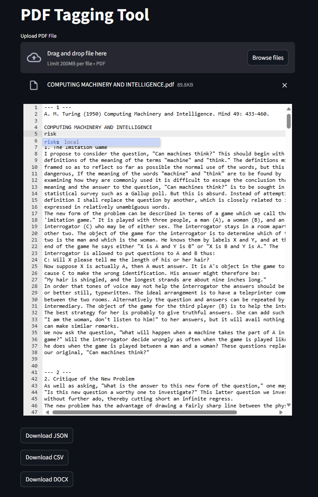

### PDF Tagging Tool

This is a lightweight **Streamlit web application** for uploading and tagging PDF documents. Ideal for auditors, reviewers, or analysts who want to annotate and export text sections in JSON or CSV formats.

---

### Environment Setup (Conda)

```bash
# 1. Create a new Conda virtual environment
conda create -n tagging-pdf python=3.12 -y

# 2. Activate the environment
conda activate tagging-pdf

# 3. Install required packages
pip install -r requirements.txt
```

---

### Run the App

```bash
streamlit run streamlit_app.py
```

---

### Features

* Upload and preview PDF documents
* Extract plain text by page
* Manual tagging/editing of extracted text
* Export results to:

  * **JSON** (structured page-wise)
  * **CSV** (rows: page\_number, text)

---

### WebAPP

